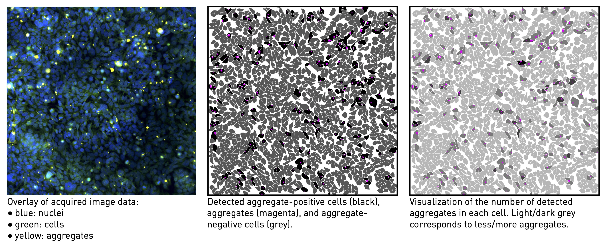

# aSynAggreCount

A codebase for automated analysis of High Content Screens.


The input image-data are assumed to be generated from 384-well plates, with 9 fields of view acquired per well, and 3 channels recorded per field, corresponding to nuclei, cells, and aggregates.
In total, 10'368 images are acquired per plate which are processed by the  **aSynAggreCount** package to quantify aggregate-positive cells.
For each image, **aSynAggreCount** performs image pre-processing to correct for the presence of uneven illumination and digitization noise, then performs segmentation of the structures of interest (nuclei, cells, aggregates), and finally applies co-localization analysis to characterize the presence of aggregates inside cells.
An illustration of the image processing pipeline is shown below.


The segmentation of nuclei and cells is performed with pre-trained Deep Learning models (see section Modules below). Aggregates are segmented using a sequence of conventional image processing filters, calibrated for the datasets of our study.
An illustration of the segmentation quality is shown in the figure below where white lines correspond to the segmentation and blue to the original image intensities for nuclei (A), cells (B) and aggregates (C).


**aSynAggreCount** utilizes the segmented data to perform co-localization analysis and characterize aggregate inclusions in cells by computing various quantities of interest (QoI), such as the percentage of aggregate-positive cells and the number of detected aggregates per cell. The figure below shows a visualization of these QoI.




## Installation

### Conda environment
Create and activate a new conda environment
```
conda create --name aSynAggreCount python=3.9.18
conda activate aSynAggreCount
```

### Tensorflow
* [Installation instructions](https://www.tensorflow.org/install/pip)
* Summary (for Linux):
```
# For GPU users:
pip install --extra-index-url https://pypi.nvidia.com tensorrt-bindings==8.6.1 tensorrt-libs==8.6.1
pip install -U tensorflow[and-cuda]
# Verification of the installation:
python3 -c "import tensorflow as tf; print(tf.config.list_physical_devices('GPU'))"
```

### StarDist
* [Installation instructions](https://github.com/stardist/stardist#installation)
* Summary:
```
pip install stardist
```

### Cellpose 2.0 with GUI  
* [Installation instructions](https://github.com/MouseLand/cellpose)
* Summary:
```
pip install cellpose[gui]
```

### Additional python packages

The following packages are required to run the code: `scikit-image matplotlib click pytest pyyaml pandas plotly kaleido`.  
They can be installed as follows:
```
pip install -r requirements_XXX.txt
```
where `XXX` is the file suffix corresponding to your OS: `requirements_Ubuntu22.04.txt` or `requirements_MaxOSX.txt`.

<!---
I installed:
    pip install scikit-image matplotlib click pytest pyyaml pandas plotly kaleido
-->


## Modules

### Nuclei segmentation

Nuclei are segmented using the [StarDist](https://github.com/stardist/stardist) pre-trained deep neural network.  
Note: Results improve if Background Equalization is done before segmentation.

<!---
Installation:  
* tensorflow: https://www.tensorflow.org/install/pip
* cupy: https://docs.cupy.dev/en/stable/install.html (`conda install -c conda-forge cupy`)
* pip install scikit-image
* pip install stardist
-->

### Cell membrane segmentation

Two methods are implemented to segment cells:  
* The [Cellpose](https://github.com/mouseland/cellpose) pre-trained deep neural network.
* The distance-intensity algorithm, inspired by [CellProfiler's](https://cellprofiler.org) Propagation method.  
    * Identifies cell boundary as a Secondary object.  
    * Uses primary objects seeds.  
    * Secondary objects are identified based on the shortest path to an adjacent primary object.  
    * The distance metric is a sum of the absolute differences in a 3x3 (8-connected) kernel.  
    * The dividing lines between secondary objects are determined by a combination of: the distance to the nearest primary object, and intensity gradients.  


### Aggregate segmentation

Aggregates are segmented through a sequence of conventional Image Processing filters, with their parameters calibrated to our data.

<!---
### Unit tests

```
conda install pytest
cd unitTests
./run.sh
```
-->


<!---
## TODOs
* [ ] Image approval.
* [ ] DL aggregated segmentation.
* [ ] Expose image processing parameters to the user.
* [ ] Test nnU-Net for cell and nuclei segmentation. Run on validation cases.
* [ ] Parallelize computations over image sets (see _prototype/multiprocess examples).
* [ ] Train a classifier to detect images that the software cannot process and alert the user about how many unprocessable images exist.
* [ ] Add more unit tests.
-->


<!---
## Package tracking

To collect all packages used by the code, [pipreqs](https://github.com/bndr/pipreqs) is used.
```
conda install pipreqs
```

Collect installed packages:
```
pip freeze > requirements.txt
```

The packages inside the requirements.txt file can be installed with
```
pip install -r requirements.txt
```
-->


## Authors

The code is developed by Athena Economides. The corresponding publication is in preparation.

If you are interested to use this code for your analysis, please contact: `athena_DOT_economides_AT_uzh.ch`.

Athena Economides, PhD  
Lab of Prof. Adriano Aguzzi  
Institute of Neuropathology  
University of Zurich  
Schmelzbergstrasse 12  
CH-8091 Zurich  
Switzerland

